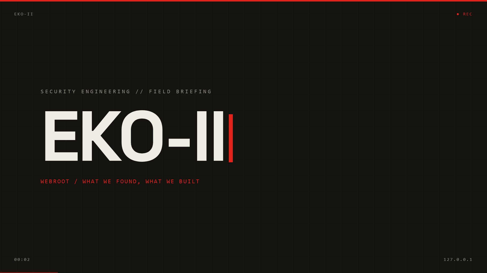

# Keycode-Agnostic Webroot Uninstaller

Remove **Webroot SecureAnywhere** from any managed machine **without hardcoding a
per-customer keycode**. Each host supplies its *own* keycode, read from its *own*
local agent config, to drive Webroot's *official* uninstaller.

> One script, any site. No hardcoded customer. No tamper bypass.

[](LICENSE)


---

## Why this exists

If you manage Webroot across many customers, you get a **separate uninstaller per site**,
each one carrying that customer's keycode baked into a compressed blob. That keycode is
the uninstaller's authorization token. It exists on purpose: Webroot runs with tamper /
self-protection so that malware cannot quietly switch off the antivirus.

So "remove Webroot for any customer" splits into a right way and a wrong way:

| | Approach | This project |
|---|---|---|
| ❌ Wrong way | Patch the signed binary to skip the keycode and tamper check | **Not done.** That defeats endpoint protection. |
| ✅ Right way | Let each machine present its **own** keycode to the official uninstaller | **This.** Supported, signature-safe, update-proof. |

The keycode this tool uses is the one **already stored on that machine** by the installed
agent. Nothing is cracked, nothing is bypassed. It is the same authority Webroot's own
per-customer uninstaller uses, just discovered at runtime instead of hardcoded.

There is a short visual briefing of the whole story (what we found vs. what we built):

[](site/eko-ii-intro.mp4)

*(`site/index.html` is the full briefing page; `site/eko-ii-intro.mp4` is the 18s intro.)*

---

## How it works (per machine)

1. **Detect** the agent (`WRSA.exe` + services + `HKLM\SOFTWARE\WR*`).
2. **Discover** that machine's keycode by scanning the `WR*` registry hives for a value
   matching the keycode shape (`XXXX-XXXX-XXXX-XXXX-XXXX`). No dependence on one value
   name, so it survives agent-version drift.
3. **Uninstall** via the official `WRSA.exe` using that keycode.
4. **Sweep** residual services, folders, registry keys, scheduled tasks.

## Usage

```powershell
# Safe dry run: detect + show the keycode source, do NOT uninstall
.\Remove-Webroot.ps1 -DiscoverOnly

# Full removal (auto-discovers the machine's own keycode)
.\Remove-Webroot.ps1

# Force a specific keycode
.\Remove-Webroot.ps1 -KeyCode AAAA-BBBB-CCCC-DDDD-EEEE

# Pin a confirmed uninstall switch
.\Remove-Webroot.ps1 -UninstallArgs "-uninstall AAAA-BBBB-CCCC-DDDD-EEEE"
```

Run **elevated** (local admin or SYSTEM).

### RMM exit codes

| Code | Meaning |
|------|---------|
| 0 | Removed, or already absent |
| 2 | Installed but keycode not discoverable (pass `-KeyCode`) |
| 3 | Uninstall ran but agent still present (confirm the switch) |
| 4 | Not elevated |

Log: `C:\ProgramData\EKO\webroot-uninstall.log`

## Validate before fleet rollout

Detection, keycode discovery, and cleanup are build-agnostic. **Two things should be
confirmed on a live agent** first, because Webroot has changed them across versions:

1. **Keycode registry location.** On a Webroot-bearing test VM:
   ```powershell
   .\Remove-Webroot.ps1 -DiscoverOnly
   ```
   It prints the masked keycode and the exact `...\value` it came from. If it cannot
   auto-discover, find the 20-char keycode with `reg query HKLM\SOFTWARE\WRData /s` and
   pin that value name in `Get-WebrootKeyCode`.
2. **Uninstall switch.** The script tries `-uninstall <KEY>`, then
   `-uninstall -keycode=<KEY>`, then `-uninstall`, stopping at whichever makes the agent
   disappear. Confirm the winner on your test VM and lock it via `-UninstallArgs`.

> If tamper protection ("uninstall password") is enabled, the **correct keycode satisfies
> it**. That is the supported path, not a bypass. If a *custom* uninstall password (not the
> keycode) was set in the console, that machine needs that password by design.

---

## Common questions

**Webroot won't uninstall, or it asks for an uninstall password / keycode.**
Webroot SecureAnywhere protects itself so that malware cannot remove it. The supported way
to remove it is with the keycode. This script reads that keycode from the machine itself
and hands it to Webroot's own uninstaller. It does not bypass the self-protection.

**Can I uninstall Webroot silently from the command line?**
Yes. Run `Remove-Webroot.ps1` elevated. It is non-interactive and returns RMM-friendly
exit codes, so it drops into NinjaOne, Datto RMM, ConnectWise Automate, Action1, Atera,
Intune, SCCM, or a GPO startup script.

**I manage many customers and every site has a different keycode.**
That is exactly what this is for. Nothing is hardcoded. Each machine presents its own
keycode, so one script covers the whole fleet.

**Does it work without knowing the keycode?**
If the agent is installed, its keycode is already on the box and the script finds it. If
it cannot (rare), pass one with `-KeyCode`. It never cracks or patches the binary.

## Repository layout

```
.
├── Remove-Webroot.ps1     the tool
├── site/                  briefing one-pager + intro video
│   ├── index.html
│   ├── eko-ii-intro.mp4
│   └── poster.jpg
├── intro/                 Remotion (React) source for the intro video
│   └── src/Intro.tsx
├── LICENSE
└── README.md
```

**Briefing page:** open `site/index.html`, or serve it
(`python -m http.server 5676 --bind 127.0.0.1 --directory site`).

**Rebuild the video:** `cd intro && npm i && npx remotion render Intro out/eko-ii-intro.mp4`.

---

## Disclaimer

This is an **independent administration tool** for environments you are authorized to
manage. It is **not affiliated with, endorsed by, or supported by Webroot or OpenText.**
"Webroot" and "Webroot SecureAnywhere" are trademarks of their respective owner.

It **does not** circumvent, disable, or weaken Webroot's tamper / self-protection. It
operates only with the keycode already present on the machine and requires administrator
rights. Use it only on systems you own or are permitted to administer. Test before any
fleet deployment. Provided **as is**, without warranty, under the MIT License.

## License

[MIT](LICENSE)

---

Built by **[sotoprojdev.com](https://sotoprojdev.com)** · callsign EKO-II.
